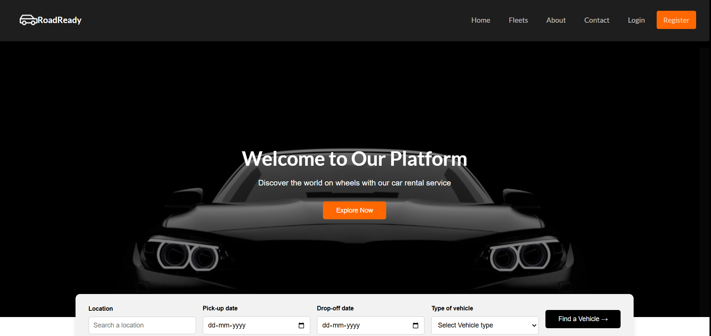

# RoadReady - A Car Rental Web Application

**RoadReady** is a car rental web application that provides users with a platform to rent cars for personal or business use. The website allows users to search, compare, and reserve vehicles easily through a user-friendly interface. It offers a wide selection of vehicles based on make, model, size, and price.

## Features

- **Authentication**: Secure sign-in and sign-up functionality for users.
- **JWT Authentication**: Secure pages that require authentication using JSON Web Tokens (JWT).
- **Car Listings**: A listing of available cars for rent.
- **Reservations**: Users can make reservations for cars and manage their profiles.
- **Search and Filter**: Users can search for specific cars using filters such as location, pickup and drop-off dates, and vehicle type.
  
## Screenshots

Below is the screenshot of the platform's home page:



## Getting Started

To get the application up and running locally, follow the steps below:

### Prerequisites

- **Frontend**: This project uses **React** for the frontend.
- **Backend**: The backend is developed using **Java** and **Spring Boot**.
  
### Installation

1. Clone this repository:
   ```bash
   git clone https://github.com/Reseraju/RoadReady.git
